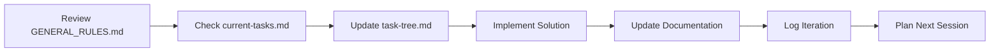

# MP Software Laravel Backend - Documentation Hub

> **⚠️ CRITICAL**: Always review [`GENERAL_RULES.md`](../GENERAL_RULES.md) before starting any development session!

---

## 📋 Project Status

**Current Phase**: Foundation & Setup  
**Last Updated**: August 19, 2025  
**Database**: PostgreSQL 17+  
**Laravel Version**: 12+  

---

## � Quick Start

### **For New Development Sessions**
1. **📖 MANDATORY**: Review [`GENERAL_RULES.md`](../GENERAL_RULES.md)
2. **📋 Check Current Tasks**: [`project-journal/current-tasks.md`](project-journal/current-tasks.md)
3. **🌳 Review Task Tree**: [`project-journal/task-tree.md`](project-journal/task-tree.md)
4. **Begin Development**: Follow established workflow

### **For New Developers**
1. Read [`GENERAL_RULES.md`](../GENERAL_RULES.md) thoroughly
2. Review [`project-journal/decisions.md`](project-journal/decisions.md) for context
3. Check [`implementation/`](implementation/) for technical guides
4. Set up development environment using guides

---

## 📁 Documentation Structure

### 🏗 **Foundation Documents**
- [`GENERAL_RULES.md`](../GENERAL_RULES.md) - **MANDATORY** development rules and workflow
- [`README.md`](README.md) - This file - documentation hub and navigation

### 📊 **Project Management** (`project-journal/`)
- [`current-tasks.md`](project-journal/current-tasks.md) - Active tasks and priorities
- [`task-tree.md`](project-journal/task-tree.md) - Task hierarchy and dependencies
- [`iteration-log.md`](project-journal/iteration-log.md) - Detailed development log
- [`decisions.md`](project-journal/decisions.md) - Architecture decision records (ADRs)
- [`blockers.md`](project-journal/blockers.md) - Issues tracking and solutions
- [`retrospectives.md`](project-journal/retrospectives.md) - Learning and improvements

### � **Implementation Guides** (`implementation/`)
*Technical implementation documentation will be created as needed:*
- Authentication & Security
- Role-Based Access Control (RBAC)
- API Standards & Design
- Database Standards (PostgreSQL)
- WebSocket Implementation
- Excel Operations
- Performance Optimization
- Code Standards & Best Practices
- Security Standards

### 🌐 **API Documentation** (`api/`)
*To be created during API development:*
- Endpoint specifications
- Authentication guide
- Response formats
- API examples

### 🚀 **Deployment** (`deployment/`)
*To be created for production:*
- Environment setup
- Server configuration
- Database deployment
- Monitoring setup

### 📎 **Assets** (`assets/`)
*Supporting materials:*
- Architecture diagrams
- Workflow visualizations
- Screenshots and examples

---

## � Technology Stack

### **Core Framework**
- **Laravel 12+** - PHP framework
- **PostgreSQL 17+** - Primary database
- **Redis** - Caching and sessions

### **Authentication & Authorization**
- **Laravel Sanctum** - API authentication
- **Spatie Laravel Permission** - RBAC system

### **Performance & Real-time**
- **Laravel Octane** - High-performance application server
- **Laravel Reverb** - WebSocket server

### **Development Tools**
- **PHPStan Level 8** - Static analysis
- **PHP CS Fixer** - Code formatting
- **PHPUnit + Pest** - Testing

---

## 📈 Development Workflow

### **Session Workflow**

### **Task Management**
1. **Planning**: All tasks tracked in `task-tree.md`
2. **Execution**: Current work in `current-tasks.md`
3. **Deviation**: Changes logged in `task-tree.md`
4. **Completion**: Results in `iteration-log.md`

### **Documentation Updates**
- **Code Changes**: Update relevant implementation docs
- **Decisions**: Record in `decisions.md`
- **Issues**: Track in `blockers.md`
- **Learning**: Capture in `retrospectives.md`

---

## 🎯 Current Development Focus

### **Active Phase**: Project Foundation
- ✅ Documentation structure established
- ✅ Development rules defined
- ✅ Task tracking system operational
- ⏳ Laravel 12 installation pending
- ⏳ PostgreSQL configuration pending

### **Next Priorities**
1. Laravel 12 project setup
2. PostgreSQL database configuration
3. Authentication system (Laravel Sanctum)
4. RBAC implementation (Spatie Permission)

---

## 🚨 Important Reminders

### **Before Every Session**
- [ ] Review [`GENERAL_RULES.md`](../GENERAL_RULES.md)
- [ ] Check [`current-tasks.md`](project-journal/current-tasks.md)
- [ ] Understand current context

### **After Every Session**
- [ ] Update task logs
- [ ] Update relevant documentation
- [ ] Log iteration details
- [ ] Plan next session

### **Never Forget**
- Documentation is as important as code
- All changes must be tracked
- Quality over speed
- Security is not optional

---

## � Quick Links

### **Development**
- [Laravel Documentation](https://laravel.com/docs)
- [PostgreSQL Documentation](https://www.postgresql.org/docs/)
- [Spatie Permission Docs](https://spatie.be/docs/laravel-permission/)

### **Project Resources**
- [Current Tasks](project-journal/current-tasks.md)
- [Task Dependencies](project-journal/task-tree.md)
- [Development Log](project-journal/iteration-log.md)
- [Architecture Decisions](project-journal/decisions.md)

---

**Last Updated**: August 19, 2025  
**Next Review**: After Laravel installation  
**Version**: 1.0.0